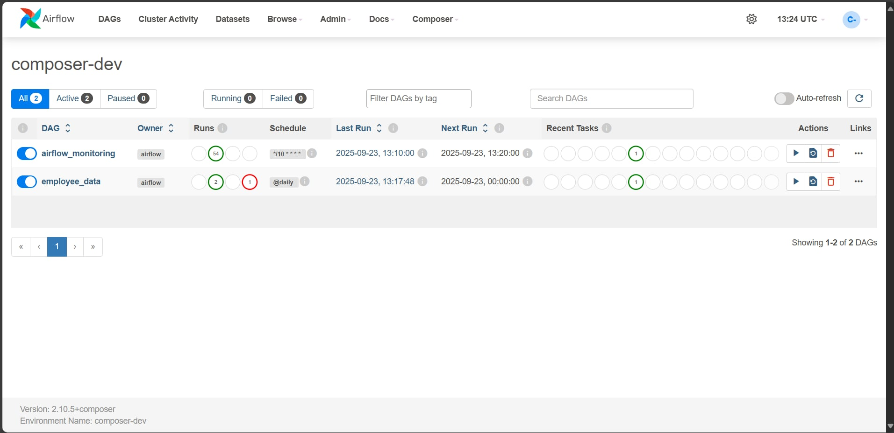
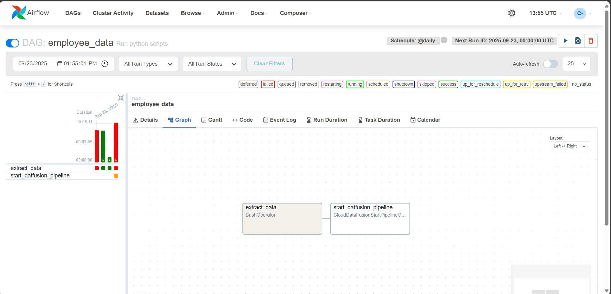
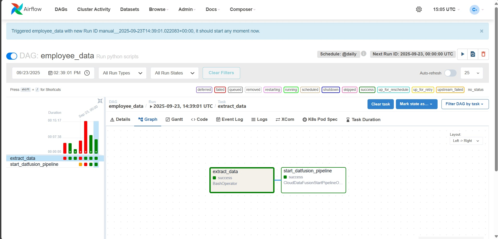
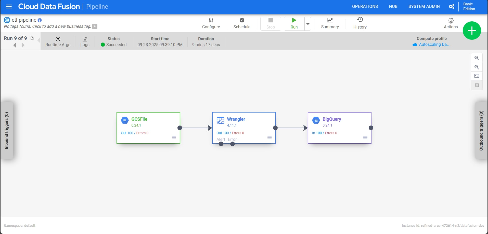
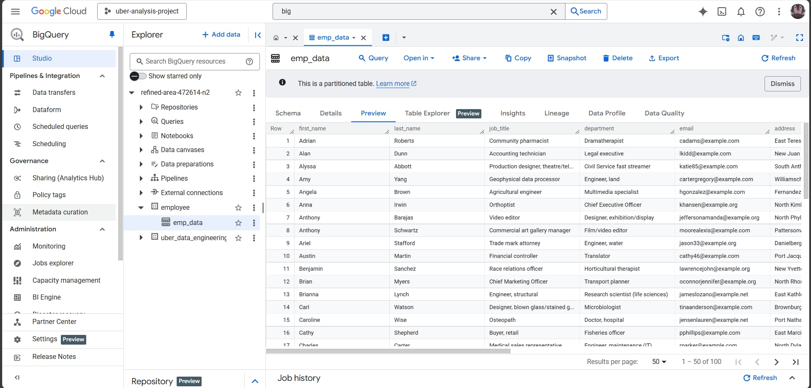
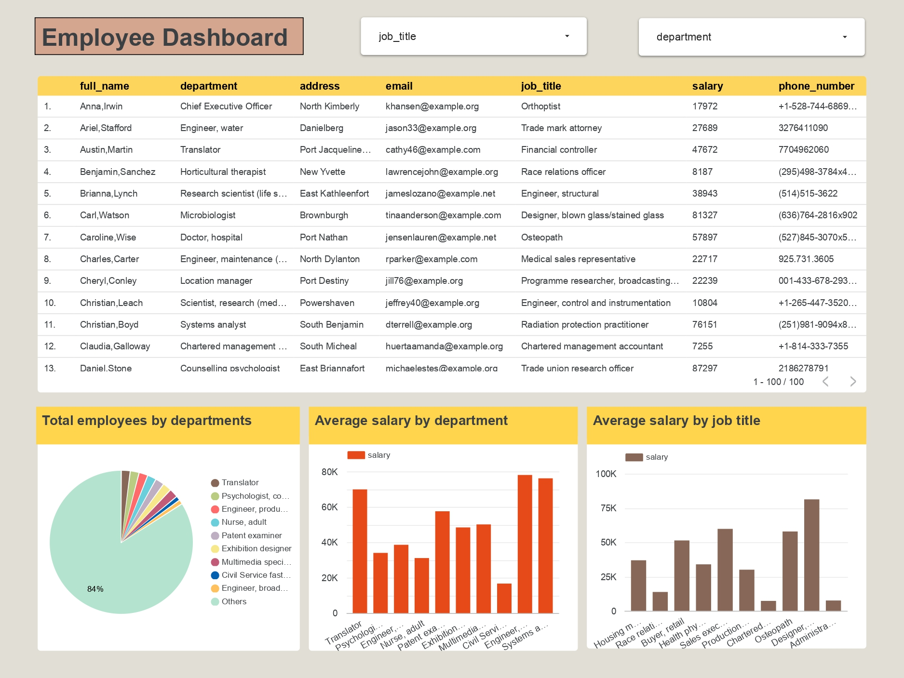

## Table of Contents
- [Overview](#overview)
- [Architecture](#architecture)
- [Step in This Project](#step-in-this-project)
- [Results](#results)

# Employee ETL Pipeline
## Overview

This project focus on designed and implemented an End-to-End Data Pipeline to manage sensitive employee data securely. This process involved extracting raw data, applying robust data masking techniques to sensitive fields, and loading the secured dataset into Google BigQuery for analytical use. I then developed a Secure Dashboard to visualize the employee data while maintaining strict access controlsใ

## Architecture

### Tech Stacks
Programming Language - Python

Google Cloud Platform
1. Google Cloud Storage
2. Cloud Data Fusion
3. Google Composer
4. Google BigQuery

Visualization tool - Google Looker Studio

## Step in This Project
1. Data Extraction: Extract employee data from multiple sources such as databases, CSV files, or APIs.
2. Data Masking: Identify sensitive information within the employee data, such as social security numbers, salary details, and personal contact information.
3. Data Loading into BigQuery: Design a process to securely load, extracted and masked employee data into BigQuery.
4. Dashboard Visualization: Develop a dashboard using employee data

## Results
1. Open Airflow UI with Google Composer

2. Airflow Pipeline

3. Run Airflow Pipeline 

5. Run Pipeline

6. Data loaded into Google Bigquery

7. Employee Dashboard

